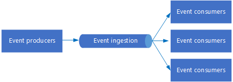

# Event-driven architecture

In an event driven architecture (EDA), application behavior is driven by asynchronous events, using a publish-subscribe (pub-sub) model. In some systems, such as IoT, events must be ingested at very high volumes.

At its heart, an EDA consists of event producers and event consumers. Producers push events to consumers, through an asynchronous publish/subscribe messaging system. There are no point-to-point integrations in this systenm. Producers are decoupled from consumers, and consumers are decoupled from each other. Message delivery happens in near real time, so consumers can respond immediately to events as they occur.

This archicture style has several flavors, depending on the volume and velocity of the event data, and the complexity of the processing by the consumers.

- **Simple event processing**. An event immediately triggers an action in the consumer. For example, you could use Azure Functions with a Service Bus trigger, so that a function executes whenever a message is published to a Service Bus topic.

- **Complex event processing**. A consumer processes a series of events, looking for patterns in the event data, using a technology such as Azure Stream Analytics or Apache Storm. For example, you could aggregrate readings from an embedded device over a time window, and generate a notification if the moving average crosses a certain threshold. 

- **Event stream processing**. Use a streaming service to ingest events, with multiple consumers for different subsystems of the application. IoT workloads fall into this category.

The source of the events may be external to the system, such as physical devices in an IoT solution. In that case, the system must be able to ingest the data at the volume and throughput that is required by the data source.

In the logical diagram above, each type of consumer is shown as a single box. In practice, there will often be multiple instances of a consumer, for reliability, and in order to handle the volume and frequency of events. A single consumers might also process events on multiple threads. This can create challenges if events must be processed in order, or require exactly-once semantics. See [Minimize Coordination][minimize-coordination]. 

## When to use this architecture

- Multiple subsystems must process the same events. 
- Real-time processing with minimum time lag.
- Complex event processing, such as pattern matching or aggregation over time windows.
- High volume and high velocity of data, such as IoT.

## Benefits

- Producers and consumers are decoupled.
- No point-to point-integrations. It's easy to add new consumers to the system.
- Consumers can respond to events immediately as they arrive. 
- Highly scalable and distributed. 
- Subsystems have independent views of the event stream.

## Challenges

- Guaranteed delivery. In some systems, especially in IoT scenarios, it's crucial to guarantee that events are delivered.
- Processing events in order. 
- Exactly-once processing.

 <!-- links -->

 [minimize-coordination]: ../design-principles/minimize-coordination.md

