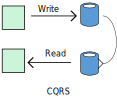

# Architecture styles

We use the term *architecture style* to mean a family of architectures that share certain characteristics. *N-tier* and *microservices* are examples of architecture styles. 

An archicture style imposes a set of *constraints* on an architecture, which guide the design. By conforming to these constraints, certain desirable properties emerge. Therefore it's important to understand not just the constraints (the "shape" of the architecture) but also the motivation behind them. 

Before choosing a particular style, make sure that you understand the underlying principles and constraints of that style. Otherwise, you can end up with a design that looks superficially as though it conforms to a particular style, but in fact does not achieve the full potential of that style. 

The choice of an architecture style does not dictate a particular technology. However, certain technologies are more naturally suited for some architectures. For example, containers are a natural fit for microservices.  

## A quick tour of the styles	

This section gives a quick tour of the architecture styles that we’ve identified, along with some high-level considerations for their use. Later sections go into more detail about each style.

**N-tier** is a traditional architecture for enterprise applications. Dependencies are managed by dividing the application into *layers* that perform logical functions, such as presentation, business logic, and data access. A layer can only call into layers that sit below it. 

However, this horizontal layering can be a liability. It can be hard to introduce changes in one part of the application without touching the rest of the application. That makes frequent updates a challenge, and can limit the rate at which new features are added. 

N-tier is most often seen in an IaaS context, although it can also include manages services. N-tier is a natural fit for migrating existing applications that already use a layered architecture. 

For a purely PaaS solution, consider a **web-queue-worker** architecture. In this style, the application has a web front end that handles HTTP requests, and a back-end worker that performs CPU-intensive tasks or long-running operations. The front end communicates to the worker through an asynchronous message queue. 
 

Web-queue-worker is suitable for relatively simple domains with some resource-intensive tasks. Like N-tier, the architecture is easy to understand. The use of managed services simplifies deployment and operations.  

With complex domains, however, it can be hard to manage dependencies. The front end and the worker can easily become large, monolithic components, which are hard to maintain and update. As with N-tier, this can reduce the frequency of updates and limit innovation.

If your application has a more complex domain, consider moving to a **microservices** architecture. A microservices application is composed of many small, independent services. Each service implements a single business capability. Services are loosely coupled, communicating through API contracts.

In a microservices architecture, services are built by small, focused development teams. Individual services can be deployed without a lot of coordination between teams, which encourages frequent updates.

A microservice architecture is more complex to build and manage than either N-tier or web-queue-worker. It requires a mature development and DevOps culture. But done right, this style can lead to higher release velocity, faster innovation, and a more resilient architecture. 

The **CQRS** (Command and Query Responsibility Segregation) style separates read and write operations into separate models. This isolates the parts of the system that update data from the parts that read the data. Moreover, reads can be executed against a materialized view that is physically separate from the write database. That lets you scale the read and write workloads independently, and optimize the materialized view for queries.

CQRS makes the most sense when it’s applied to a subsystem of a larger architecture. Generally, you shouldn’t impose it across the entire application, as that will just create unneeded complexity. Consider it for collaborative domains where many users access the same data.

An **event-driven architecture** uses a publish-subscribe (pub-sub) model, where producers pubish events, and consumers subscribe to them. The producers are independent from the consumers, and consumers are independent from each other. 

Consider an event-driven architecture for applications that must ingest and process a large volume of data with very low latency, such as IoT solutions. It’s also useful when different subsystems must perform different types of processing on the same event data.

Finally, **big data** and **big compute** are specialized architectural styles for workloads that fit certain specific profiles. Big data divides a large dataset into chunks, performing paralleling processing across the entire set. A common scenario for big data is machine learning. Big compute, also called high-performance computing (HPC), makes parallel computations across a large number (thousands) of cores. Domains include simulations, modeling, and 3-D rendering.

| Architecture style |	Dependency management | Domain type |
|--------------------|------------------------|-------------|
| N-Tier | Horizontal layers | Traditional business domain. Frequency of updates is low. |
| Web-Queue-Worker | Front/Backend jobs | Decoupled by async messaging. Relatively simple domain with some resource intensive tasks. |
| Microservices	| Vertical (functional) decoupling. | Complicated domain. Frequent updates. |
| CQRS | Read/write segregation. Schema and scale are optimized separately. | Collaborative domain where lots of users access the same dat. |
| Event-driven architecture. | Data ingested into streaming.  Independent view per sub-system. | IoT |
| Big data | Divide a huge dataset into small chunks. Parallel processing on local datasets. | Batch and real-time data analysis. Predictive analysis using ML. |
| Big compute| Data allocation to thousands of cores. | Compute intensive domains such as simulation. |

The next sections go into more detail about each style. 

- A logical diagram showing the important parts of the architecture.
- Recommendations for when to choose this architecture style
- Benefits and challenges.
- A diagram showing a recommended deployment, including the relevant Azure services and resources.

