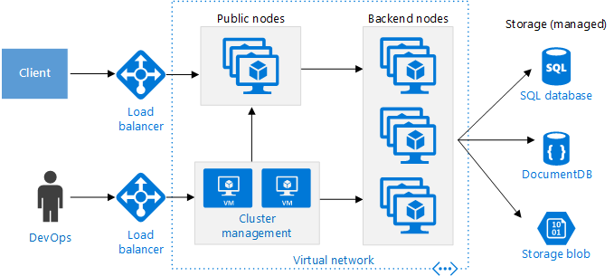
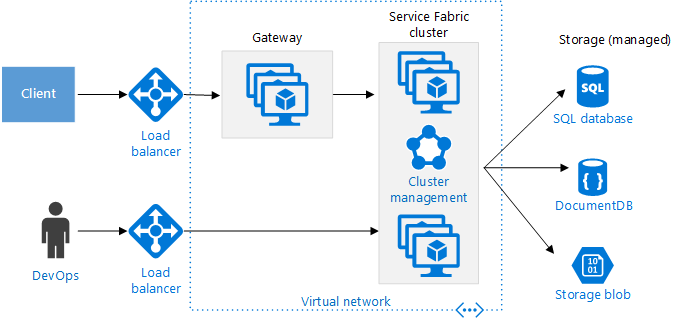

# Microservices

A microservices architecture consists of a collection of small, autonomous services. Each service is self-contained and should implement a single business capability. 

There are two main options for building a microservices application on Azure:

- Containers using a container orchestrator such as Docker Swarm, DC/OS, or Kubernetes. 
- Azure Service Fabric.

 

In some ways, microservices are the natural evolution of service oriented architectures (SOA), but there are differences between microservices and SOA. Here are some defining characteristics of a microservice:

- In a microservices architecture, services are small, independent, and loosely coupled.

- Each service is a separate codebase, which can be managed by a small development team.

- Services can be deployed independently. A team can update an existing service without re-building and redeploying the entire application.

- Services are responsible for persisting their own data or external state. This differs from the traditional model, where a separate data layer handles data persistence.

- Services communicate with each other by using well-defined APIs. Internal implementation details of each service are hidden from other services.

- Services don't need to share the same technology stack, libraries, or frameworks.

Besides for the services themselves, some other components appear in a typical microservices architecture:

**Management**. The management component is reponsible for placing services on nodes, identifying failures, rebalancing services across nodes, and so forth.  

**Service Discovery**.  Maintains a list of services and which nodes they are located on. Enables service lookup to find the endpoint for a service. 

**API Gateway**. The API gateway is the entry point for clients. Clients don’t call services directly. Instead, they call the API gateway, which forwards the call to the appropriate services on the back end. The API gateway might aggregate the responses from several services and return the aggregrated response. 

The advantages of using an API gateway include:

- It decouples clients from services. Services can be versioned or refactored without needing to update all of the clients.

-  Services can use messaging protocols that are not web-friendly, such as AMQP.

- The API Gateway can perform other cross-cutting functions such as authentication, logging, SSL termination, and load balancing.

## When to use this architecture

Consider this architectural style for:

- Large applications that require a high release velocity.

- Complex applications that need to be highly scalable.

- Applications with rich domains or many subdomains.

- An organization that consists of small development teams.

## Benefits 

- **Small, focused teams.** Teams can focus on one service. The smaller scope of each service makes the code base easier to understand and reason about. It's easier to ramp up.

- **Independent deployments**. You can update a service without re-deploying the entire application, and roll back an update if somethign goes wrong. Bug fixes and feature releases are more manageable and less risky.

- **Independent development**. A single development team can build, test, and deploy a service. The result is continuous innovation and a faster release cadence. 

- **Fault isolation**. If a service goes down, it won’t take out the entire application. However, that doesn't mean the microservices gives you resiliency for free. You still need to follow resiliency best practices and design patterns.

- **Mixed technology stacks**. Teams can pick the technology that best fits their service. 

- **Granular scaling**. Services can be scaled independently. At the same time, the higher density of services per VM means that VM resources are fully utilized. Using placement constraints, a services can be matched to a VM profile (high CPU, high memory, etc).

## Challenges

- **Complexity**. A microservices application has more moving parts than the equivalent monolithic application. Each service is simpler, but the entire system as a whole is more complex.

- **Lack of governance.** The decentralized approach to building microservices has advantages, but it can also lead to problems. You may end up with so many different languages and frameworks that the applications becomes hard to maintain. It may be useful to put some project-wide standards in place, without overly restricting teams' flexibility. This especially applies to cross-cutting functionality such as logging.

- **Network congestion and latency**. The use of many small, granular services can result in more interservice communication. Also, if the chain of service dependencies gets too long (service A calls B, which calls C...), the additional latency can become a problem. You will need to design APIs carefully. Avoid overly chatty APIs, think about serialization formats, and look for places to use asynchronous communication patterns.

- **Data consistency**. With each microservice responsible for its own data persistence, the application does not have a single data schema. As a result, data consistency can be a challenge. Embrace eventual consistency where possible.

- **Management**. To be successful with microservices requires a mature DevOps culture.

- **Logging**. Correlated logging across services can be challenging. Typically, logging must correlate multiple service calls for a single user operation.

- **Versioning**. Updates to a service must not break services that depend on it. Multiple services could be updated at any given time, so without careful design, you might have problems with backward or forward compatibility.

- **Skillset**. Microservices are highly distributed systems. Carefully evaluate whether the team has the skills and experience to be succesful.

## Principles

- Use domain-driven design to find natural service boundaries. 

- Favor small bounded contexts. Don't try to create a single domain model across all microservices. 

- Use context mapping to clarify the relationship between domain models. 

- Avoid coupling between services. Causes of coupling include shared database schemas and rigid communication protocols.

- Avoid the Enterprise Service Bus pattern that builds domain logic into the messaging infrastructure.

- Services should have loose coupling and high functional cohesion. Functions that are likely to change together should be packaged and deployed together. If they reside in separate services, those services end up being tightly coupled, because a change in one service will require updating the other service. Overly chatty communication betweeen two services may be a symptom of tight coupling and low cohesion. 

## Microservices using containers on Azure

The following diagram shows a microservices architecture using containers running on Azure.

 
You can use Azure Container Service to configure and provision a Docker cluster. Azure Container Services supports several popular container orchestrators, including DC/OS, Docker Swarm, and Kubernetes.

**Public nodes** are reachable through a public-facing load balancer. The API gateway is hosted on these nodes.

**Backend nodes** run services that clients reach via the API gateway. These nodes don’t receive Internet traffic directly. The backend nodes might include more than one pool of VMs, each with a different hardware profile. For example, you could create separate pools for general compute workloads, high CPU workloads, and high memory workloads. 

**Management VMs** run the master nodes for the container orchestrator. 

**Networking**. The public nodes, backend nodes, and management VMs are placed in separate subnets within the same virtual network (VNet). 

**Load balancers**.  An externally facing load balancer sits in front of the public nodes. It distributes internet requests to the public nodes. Another load balancer is placed in front of the management VMs, to allow ssh traffic to the management VMs, using NAT rules. 

For reliability and scalability, each service is replicated across multiple VMs. However, because services are also relatively lightweight (compared with a monolithic application), multiple services are usually packed into a single VM. Higher density allows better resource utilization. If a particular service doesn’t use a lot of resources, you don’t need to dedicate an entire VM to running that service.

The following diagram shows three nodes running four different services (indicated by different shapes). Notice that each service has at least two instances. 
 

## Microservices using Azure Service Fabric

The following diagram shows a microservices architecture using Azure Service Fabric

The Service Fabric Cluster is deployed to one or more VM scale sets. You might have more than one VM scale set in the cluster, in order to have a mix of VM types. An API Gateway is placed in front of the Service Fabric cluster, with an external load balancer to receive client requests.

The Service Fabric runtime automatically handles node failover, health monitoring, and other cluster management functions. Services communicate with each other using the reverse proxy that is built into Service Fabric. Service Fabric provides a discovery service that can resolve the endpoint for a named service.

